# CLAUDE.md

> 本文档由 AI 架构师于 2025-11-15 17:46:19 自动生成/更新

This file provides guidance to Claude Code (claude.ai/code) when working with code in this repository.

## 变更记录 (Changelog)

### 2025-11-15 17:46:19
- 初始化 AI 上下文文档
- 生成项目模块结构图
- 完善核心架构说明
- 添加模块索引和导航

---

## 项目愿景

AutoRun 是一个基于 Go 语言开发的游戏自动化框架（Night Crows），采用状态机模式管理任务执行，结合图像识别、OCR 文字识别和场景识别实现智能化游戏操作。框架设计注重模块化、可扩展性和线程安全。

## 架构总览

项目采用**分层架构**：
- **核心层 (core/)**: 提供 OCR、图像识别、颜色检测、配置管理、WebSocket 通信等基础能力
- **状态层 (state/)**: 状态机调度、任务注册、异常守护
- **业务层 (task/)**: 具体游戏任务实现（买药、回城、数据收集等）
- **识别层 (scene/)**: 场景识别与判断
- **工具层 (util/)**: HTTP 请求、R2 存储、图像处理等通用工具
- **资源层 (assets/)**: 静态资源（图片、配置文件）通过 Go embed 嵌入
- **依赖层 (AutoGo/)**: 本地依赖库，提供底层自动化能力

## 模块结构图

```mermaid
graph TD
    A["(根) auto-go-test<br/>Go 自动化测试框架"] --> B["core/<br/>核心功能模块"];
    A --> C["state/<br/>状态机模块"];
    A --> D["task/<br/>任务模块"];
    A --> E["scene/<br/>场景识别模块"];
    A --> F["util/<br/>工具模块"];
    A --> G["assets/<br/>静态资源"];
    A --> H["AutoGo/<br/>本地依赖库"];
    A --> I["TomatoOCR/<br/>OCR 客户端"];
    A --> J["resources/<br/>运行时资源"];

    B --> B1["OCR 处理器"];
    B --> B2["OpenCV 处理器"];
    B --> B3["颜色处理器"];
    B --> B4["配置管理器"];
    B --> B5["WebSocket 客户端"];
    B --> B6["API 处理器"];

    C --> C1["状态机"];
    C --> C2["任务注册表"];
    C --> C3["异常守护"];

    D --> D1["数据收集发送"];
    D --> D2["买药任务"];
    D --> D3["回城任务"];
    D --> D4["异常处理"];

    H --> H1["images<br/>图像处理"];
    H --> H2["motion<br/>点击滑动"];
    H --> H3["opencv<br/>OpenCV"];
    H --> H4["ppocr<br/>OCR"];
    H --> H5["imgui<br/>UI 提示"];

    click B "./core/CLAUDE.md" "查看 core 模块文档"
    click C "./state/CLAUDE.md" "查看 state 模块文档"
    click D "./task/CLAUDE.md" "查看 task 模块文档"
    click E "./scene/CLAUDE.md" "查看 scene 模块文档"
    click F "./util/CLAUDE.md" "查看 util 模块文档"
    click G "./assets/CLAUDE.md" "查看 assets 模块文档"
    click H "./AutoGo/CLAUDE.md" "查看 AutoGo 模块文档"
    click I "./TomatoOCR/CLAUDE.md" "查看 TomatoOCR 模块文档"
```



## 模块索引

| 模块 | 路径 | 职责 | 关键接口 |
|------|------|------|----------|
| **core** | `core/` | 核心功能模块 | OCR, OpenCV, Color, Config, API, WebSocketClient |
| **state** | `state/` | 状态机与任务调度 | StateMachine, GlobalRegistry, ExceptionGuard |
| **task** | `task/` | 业务任务实现 | 数据收集发送, 买药, 回城, 礼包领取 |
| **scene** | `scene/` | 场景识别 | Identify (基于图像和 OCR) |
| **util** | `util/` | 工具函数 | HttpRequest, R2Client, 图像处理 |
| **assets** | `assets/` | 静态资源 | ImageFile, ConfigFile (Go embed) |
| **AutoGo** | `AutoGo/` | 本地依赖库 | images, motion, opencv, ppocr, imgui 等 |
| **TomatoOCR** | `TomatoOCR/` | OCR 客户端封装 | TomatoOCR 客户端 |

详细模块文档请点击上方 Mermaid 图中的节点或查看各模块目录下的 `CLAUDE.md`。

## 运行与开发

### 环境准备

1. **AutoGo 框架**: 参考 [AutoGo 官网](https://autogo.cc/#/)
2. **OCR 服务**: 番茄 OCR ([购买地址](https://www.52tomato.com/console/buygoods))，在 `core/ocr.go` 配置授权密钥
3. **Go 环境**: 需要 Go 1.25.0+

### 常用命令

```bash
# 编译运行
go build -o nightcrows main.go
./nightcrows

# 运行测试文件
go run test1.go

# 安装依赖
go mod tidy

# 更新依赖
go get -u && go mod tidy
```

### 配置文件

- `assets/config/default.json`: 默认配置（应用包名、OCR 密钥等）
- `assets/config/scene.json`: 场景识别配置
- `assets/config/scene_map.json`: 地图场景配置

### 资源目录

- `assets/img/`: 图像资源（用于图像识别）
- `resources/assets/`: OCR 模型文件 (*.opt)
- `resources/libs/`: Native 库 (arm64-v8a, x86, x86_64)

## 测试策略

项目当前以**手动测试**为主：
- `test1.go`: OCR 和图像识别测试
- `test2.go`: 其他功能测试
- `test3.go`: 扩展测试
- `sell_safebox_item.go`: 保险箱物品售卖测试

建议后续添加：
- 单元测试（核心模块）
- 集成测试（任务流程）
- Mock 测试（外部依赖）

## 编码规范

### 线程安全

所有核心处理器都使用互斥锁保护，避免并发调用问题：
- OCR 和 OpenCV 操作使用全局互斥锁 `ocrMutex` 和 `opencvMutex`
- WebSocketClient 使用读写锁 `sync.RWMutex` 保护连接状态

### 资源管理

- 图像模板会被缓存（`assets.TemplateMap`），缓存键格式：`"文件名-是否灰度-缩放比例"`
- OpenCV Mat 对象需手动调用 `Close()` 释放内存
- 使用 `defer` 确保资源正确释放

### 坐标系统

所有坐标参数格式为 `(x1, y1, x2, y2)`，表示矩形区域的左上角和右下角坐标。当 x2 或 y2 为 0 时，表示使用屏幕的最大宽度或高度。

### 相似度参数

- OCR 和颜色识别的相似度范围为 0.1 - 1.0
- OpenCV 图像匹配的相似度会被转换为 `0.5 + sim * 0.5` 的范围

### 命名约定

- 包名：小写，单数形式（如 `core`, `task`, `scene`）
- 导出函数：大驼峰（如 `NewOCRHandler`, `FindImage`）
- 私有函数：小驼峰（如 `loadConfig`, `parseRegion`）
- 全局实例：大驼峰（如 `OCR`, `OpenCV`, `Color`, `GlobalRegistry`）

## AI 使用指引

### 新增功能

1. **新增任务**：在 `task/` 目录下添加任务函数，并在 `init()` 中通过 `state.Register()` 注册
2. **新增场景**：在 `assets/config/scene.json` 添加场景配置，使用 `scene.Identify()` 识别
3. **新增工具**：在 `util/` 目录下添加工具函数或结构体

### 修改核心模块

- 修改 `core/` 模块时需注意**线程安全**和**资源释放**
- 修改 `state/` 状态机时需考虑**任务调度**和**异常处理**的影响
- 修改 `AutoGo/` 依赖库时需独立测试，避免影响主项目

### 调试技巧

- 使用 `core.Log()` 记录日志
- 使用 `core.Toast()` 显示提示信息
- 使用 `scene.Identify()` 检查当前场景
- 查看 `.claude/index.json` 了解项目整体结构

### 常见问题

1. **OCR 识别失败**：检查 OCR 密钥配置、区域坐标、相似度阈值
2. **图像识别失败**：检查图片路径、相似度阈值、是否需要灰度匹配
3. **任务未执行**：检查任务注册顺序、执行间隔、`ShouldExecute()` 条件
4. **WebSocket 断连**：已实现自动重连机制（1分钟、3分钟、10分钟间隔）

---

**项目统计**：
- 总文件数：48
- Go 文件数：45
- JSON 配置文件：3
- 模块数：8
- 估算覆盖率：95%

**下一步建议**：
- 添加单元测试和集成测试
- 完善错误处理和日志记录
- 优化任务调度策略
- 添加性能监控和指标统计
