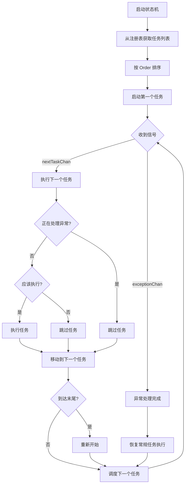

# state 模块文档

[根目录](../CLAUDE.md) > **state**

> 本文档由 AI 架构师于 2025-11-15 17:46:19 生成

## 变更记录 (Changelog)

### 2025-11-15 17:46:19
- 初始化模块文档

---

## 模块职责

`state` 模块负责**任务调度与状态管理**，采用**状态机模式**实现：

1. **状态机** (machine.go): 管理任务循环执行、异常处理暂停与恢复
2. **任务注册表** (registry.go): 注册和管理所有任务，支持优先级排序
3. **异常守护** (exception.go): 监听异常场景，触发异常处理流程

核心设计理念：**任务轮询 + 异常优先**。

## 入口与启动

### 状态机创建与启动

```go
// main.go
machine := state.NewStateMachine()
machine.Run() // 启动状态机（阻塞）
```

### 任务注册

任务在各模块的 `init()` 函数中自动注册：

```go
// task/tasks.go init()
func init() {
    state.Register("数据收集发送", 数据收集发送, 0, 30*time.Minute)
    state.Register("买药", 买药, 1, 12*time.Hour)
}
```

## 对外接口

### StateMachine (状态机)

| 方法 | 功能 | 参数 | 返回值 |
|------|------|------|--------|
| `NewStateMachine()` | 创建状态机 | 无 | *StateMachine |
| `Run()` | 运行状态机（阻塞） | 无 | 无 |
| `StartExceptionHandling()` | 开始异常处理 | 无 | 无 |
| `StopExceptionHandling()` | 结束异常处理 | 无 | 无 |
| `NotifyExceptionHandled()` | 异常处理完成通知 | 无 | 无 |
| `Wait()` | 等待异常处理完成 | 无 | 无 |
| `IsHandlingException()` | 检查是否正在处理异常 | 无 | bool |

### Registry (任务注册表)

| 方法 | 功能 | 参数 | 返回值 |
|------|------|------|--------|
| `Register(name, taskFunc, order, interval)` | 注册任务 | 名称, 函数, 顺序, 间隔 | 无 |
| `GetOrderedTasks()` | 获取所有任务（按顺序） | 无 | []*TaskInfo |
| `GetTask(name)` | 获取指定任务 | 名称 | (*TaskInfo, bool) |

### TaskInfo (任务信息)

| 方法 | 功能 | 参数 | 返回值 |
|------|------|------|--------|
| `ShouldExecute()` | 检查是否应执行 | 无 | bool |
| `Execute()` | 执行任务 | 无 | error |

### 全局函数

| 函数 | 功能 | 参数 | 返回值 |
|------|------|------|--------|
| `Register(name, taskFunc, order, interval)` | 注册任务（便捷函数） | 名称, 函数, 顺序, 间隔 | 无 |
| `Wait()` | 等待异常处理完成（全局） | 无 | 无 |
| `IsHandlingException()` | 检查是否正在处理异常（全局） | 无 | bool |

## 关键依赖与配置

### 依赖项

- `app/core`: 核心模块（用于日志记录）
- `github.com/pkg/errors`: 错误堆栈追踪
- `sync`: 线程安全（读写锁）
- `time`: 时间管理

### 配置参数

- `taskInterval`: 任务执行间隔（默认 2 秒）

## 数据模型

### StateMachine

```go
type StateMachine struct {
    currentTaskIndex    int           // 当前任务索引
    tasks               []*TaskInfo   // 任务列表
    nextTaskChan        chan bool     // 下一个任务信号
    exceptionChan       chan bool     // 异常处理信号
    isHandlingException bool          // 是否正在处理异常
    mutex               sync.RWMutex  // 读写锁
    taskInterval        time.Duration // 任务执行间隔
}
```

**工作流程**：
1. 初始化时从 `GlobalRegistry` 获取所有任务并按 `Order` 排序
2. 主循环监听两个信号：`nextTaskChan`（下一个任务）和 `exceptionChan`（异常处理完成）
3. 执行任务前检查 `isHandlingException`，如果正在处理异常则跳过常规任务
4. 任务执行完成后移动到下一个任务，循环到末尾则重新开始

### TaskInfo

```go
type TaskInfo struct {
    Name         string        // 任务名称
    Func         TaskFunc      // 任务函数
    Order        int           // 执行顺序
    Interval     time.Duration // 执行间隔，0 表示每轮都执行
    LastExecuted time.Time     // 上次执行时间
    Description  string        // 任务描述
}
```

**执行条件**：
- `Interval == 0`: 每轮都执行
- `Interval > 0`: 距离上次执行超过 `Interval` 时间才执行

### TaskFunc

```go
type TaskFunc func() error
```

任务函数类型，返回 `error` 表示执行失败。

## 任务注册与调度机制

### 注册方式

```go
state.Register("任务名称", 任务函数, 执行顺序, 执行间隔)
```

**参数说明**：
- `name`: 任务名称（用于日志和调试）
- `taskFunc`: 任务函数（类型为 `TaskFunc`）
- `order`: 执行顺序（数字越小越优先，相同则按注册顺序）
- `interval`: 执行间隔（`0` 表示每轮都执行，`time.Hour` 表示每小时执行一次）

### 调度流程



### 异常处理机制

异常守护 (`ExceptionGuard`) 监听异常场景，触发异常处理流程：

1. 检测到异常场景（如弹窗、卡死）
2. 调用 `StateMachine.StartExceptionHandling()` 暂停常规任务
3. 执行异常处理任务
4. 处理完成后调用 `StateMachine.NotifyExceptionHandled()` 恢复常规任务

**任务内部等待**：
- 使用 `state.Wait()` 等待异常处理完成
- 避免在异常处理期间执行可能冲突的操作

## 测试与质量

### 当前测试覆盖

- 无自动化测试
- 通过 `main.go` 手动测试状态机运行

### 建议补充

1. 单元测试：任务注册、排序、执行条件判断
2. 集成测试：状态机循环、异常处理暂停与恢复
3. 并发测试：多线程场景下的线程安全

## 常见问题 (FAQ)

### 1. 任务没有执行怎么办？

- 检查任务是否正确注册（查看启动日志）
- 检查 `Order` 和 `Interval` 是否符合预期
- 检查 `ShouldExecute()` 条件是否满足
- 检查是否正在处理异常（使用 `state.IsHandlingException()`）

### 2. 如何调整任务执行顺序？

修改任务注册时的 `order` 参数，数字越小越优先。

### 3. 如何让任务每轮都执行？

将 `interval` 设置为 `0`。

### 4. 如何让任务定时执行？

将 `interval` 设置为时间间隔，如 `30*time.Minute`、`12*time.Hour`。

### 5. 异常处理期间任务会执行吗？

不会。异常处理期间，常规任务会被跳过，直到异常处理完成。

### 6. 如何在任务中等待异常处理完成？

使用 `state.Wait()`，该函数会阻塞直到异常处理完成。

## 相关文件清单

### 核心源码

- `machine.go`: 状态机实现
- `registry.go`: 任务注册表
- `exception.go`: 异常守护

### 相关模块

- `../task/`: 任务实现
- `../core/`: 核心模块（日志记录）

---

**模块统计**:
- 文件数: 3
- 导出接口数: 10+
- 全局实例数: 1 (GlobalRegistry)
- 线程安全: 是（状态机使用读写锁）
